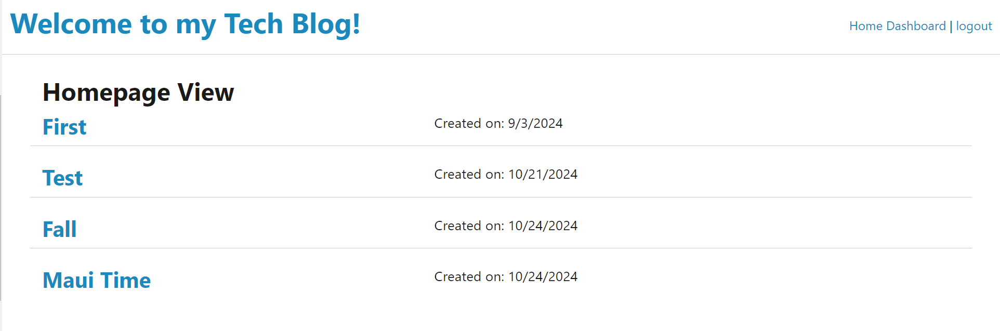
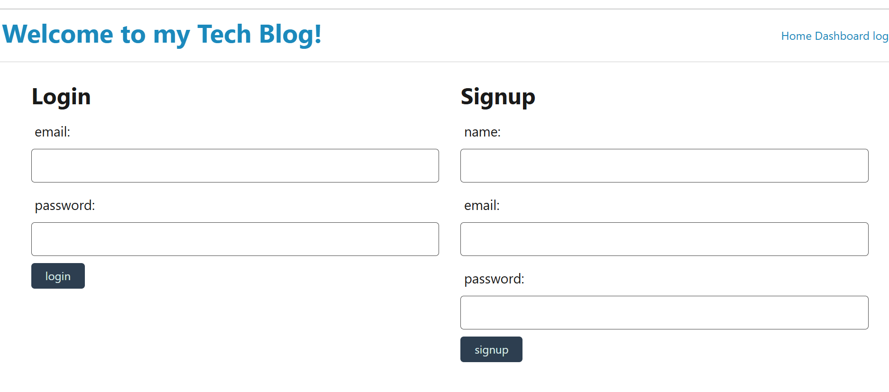

# Model-View-Controller-MVC-Tech-Blog

## Description 
Writing about tech can be just as important as making it. Developers spend plenty of time creating new applications and debugging existing codebases, but most developers also spend at least some of their time reading and writing about technical concepts, recent advancements, and new technologies. A simple Google search for any concept covered in this course returns thousands of think pieces and tutorials from developers of all skill levels!

## Tables of Contents:
Overview
The Challenge
Usage
Installation Process
Built With 
What I Learned
License

## Overview
The Challenge:

The challenge of building this application involved creating a scalable and robust platform that could support multiple users,blog post and comments. The application was designed with security in mind , allowing users to autheticate themselves and protect their personal data.Furthermore, the application had to be built with modern web development technologies and follow best practices, including the MVC architecture pattern.

## User Story :

AS A developer who writes about tech
I WANT a CMS-style blog site
SO THAT I can publish articles, blog posts, and my thoughts and opinio

## Acceptance Criteria :

GIVEN a CMS-style blog site
WHEN I visit the site for the first time
THEN I am presented with the homepage, which includes existing blog posts if any have been posted; navigation links for the homepage and the dashboard; and the option to log in
WHEN I click on the homepage option
THEN I am taken to the homepage
WHEN I click on any other links in the navigation
THEN I am prompted to either sign up or sign in
WHEN I choose to sign up
THEN I am prompted to create a username and password
WHEN I click on the sign-up button
THEN my user credentials are saved and I am logged into the site
WHEN I revisit the site at a later time and choose to sign in
THEN I am prompted to enter my username and password
WHEN I am signed in to the site
THEN I see navigation links for the homepage, the dashboard, and the option to log out
WHEN I click on the homepage option in the navigation
THEN I am taken to the homepage and presented with existing blog posts that include the post title and the date created
WHEN I click on an existing blog post
THEN I am presented with the post title, contents, post creator’s username, and date created for that post and have the option to leave a comment
WHEN I enter a comment and click on the submit button while signed in
THEN the comment is saved and the post is updated to display the comment, the comment creator’s username, and the date created
WHEN I click on the dashboard option in the navigation
THEN I am taken to the dashboard and presented with any blog posts I have already created and the option to add a new blog post
WHEN I click on the button to add a new blog post
THEN I am prompted to enter both a title and contents for my blog post
WHEN I click on the button to create a new blog post
THEN the title and contents of my post are saved and I am taken back to an updated dashboard with my new blog post
WHEN I click on one of my existing posts in the dashboard
THEN I am able to delete or update my post and taken back to an updated dashboard
WHEN I click on the logout option in the navigation
THEN I am signed out of the site
WHEN I am idle on the site for more than a set time
THEN I am able to view posts and comments but I am prompted to log in again before I can add, update, or delete posts

## Usage Instructions:

Visit the homepage, "Login" or "Sign Up" for an account if you don't already have one.
1- Option A:  Account login: click on "login" in the navigation menu - enter Username and Password then click "Sign In" to proceed.
2- Option B: Account Sign Up: click on "Sign Up" in the navigation menu - once open, enter Username, Email and Password then click "Sign Up" to proceed.
3- Once you have an account, you can create blog posts .
4- Enter a title and contents for your  Blog Contribution, then click "Create Post" to save and publish.
5- View existing blog posts by clicking on "Home" in the navigation menu.
6- Edit or delete your blog post: click on the "dashboard" option in the navigation menu and select the post you wish to edit or delete.
7- Account Log out: click on "logout" in the navigation menu.

## Deployed Application Link:
[Deployed APP](https://model-view-controller-mvc-tech-blog-ans0.onrender.com)

## ScreenShots:

## Installation Process
Clone the Repository from GitHub (or) Download Zip Folder from Repository from GitHub Open the cloned (or downloaded) repository in any source code editor.

## Built With :
Json
JavaScript
Node.js
Express.js
Sequelize : 6.37.3
Dotenv : 16.4.5
Express : 4.18.2
Exptess Handlebars : 8.0.1
Handlebars.js
Visual Studio Code
Bcrypt : 5.1.1
Express-Session : 1.18.0

## What I Learned : 
1. Implementing Model-View-Controller (MVC) architecture.
2. Creating and using Express.js servers and routes.
3. Using Handlebars.js to create and display dynamic templates.
4. Implementing user authentication and password hashing with bcrypt.
5. Using Bootstrap for styling and layout.

## License
MIT

